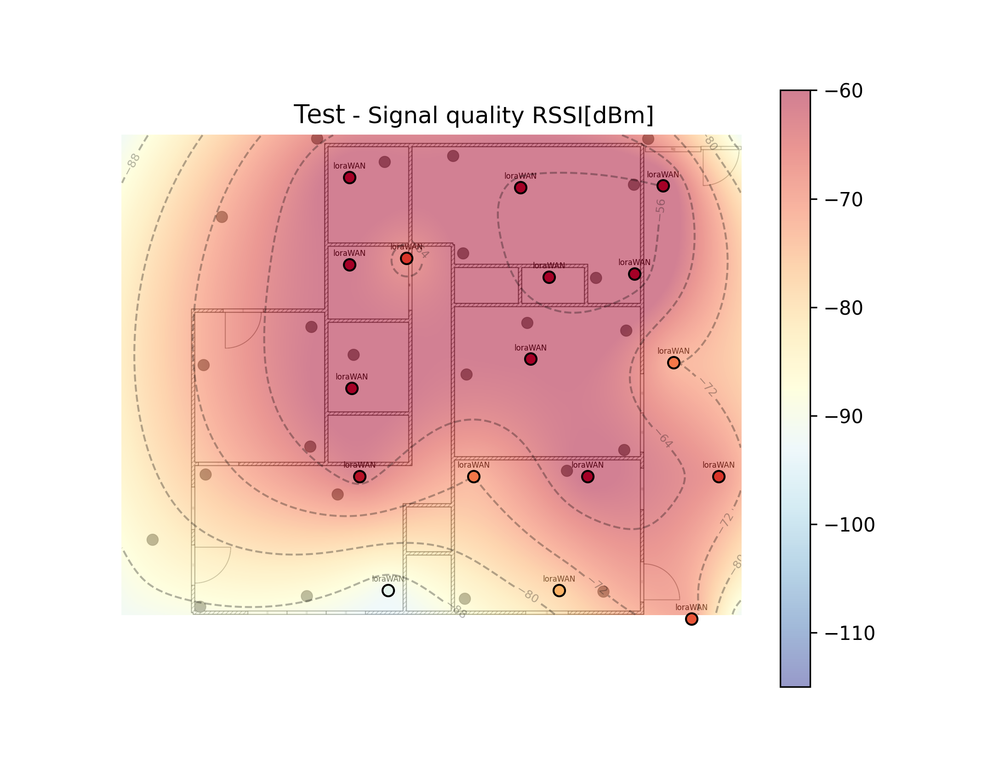

# LoRa-survey-heatmap

A Python application for LoRa site surveys and present
the results as a heatmap overlayed on a floorplan.

## Quick start

Check out the **Running In Docker** steps below to get single-line commands that run without the need to install *anything* on your computer (thanks to using `docker`).
Creating a heatmap using the software consists of the following three essential steps:

1. Perform a LoRa site coverage survey with a FieldTest device.
2. Mark every measurements on the map with a marker with corresponding packet number.
3. Create your json survey file with the measurements, and locations called to the image size. An easy way will be via the chirpstack export and filtered and converted with my nodejs converter, see more down bellow.
4. Once done with all the measurements, use the `lora-heatmap` tool to compute a high-resolution heatmap from your recorded data. 

In case your data turns out to be too coarse, you can always go back to step 2 and delete or move old and also add new measurements at any time.

### Installation and Dependencies

**NOTE: These can all be ignored when using Docker. DOCKER IS THE RECOMMENDED INSTALLATION METHOD. See below.**

Installation is via ``python setup.py develop`` in a virtualenv setup with ``--system-site-packages`` (for the above dependencies).

Tested with Python 3.8.

## Usage

Add `--show-points` to see the measurement points in the generated maps. Typically, they aren't important when you have a sufficiently dense grid of points so they are hidden by default.

Add `--contours [N]` If specified, N contour lines will be added to the graphs.

Add `--verbose` to get a verbose output.

Add `--picture` to set the path to background image.

Add `--thresholds` to set the path thresholds JSON file path.

### Running In Python

you need to have the following files in the data folder:

* a json file with the survey data, check the [Sample.json](data/Sample.json) file for the format.
* a picture of the floorplan
* a json file with the thresholds (optional), check the [thresholds.json](data/thresholds.json) file for the format.

```bash
python src/heatmap.py data/Sample.json --verbose --contours 5 --show-points --picture data/floorplan_marks.png --thresholds data/thresholds.json
```

### Running In Docker

recommanded and easy way

```bash
docker run -it --rm -v ./data:/data -w /data --name heatmap docker.io/nechry/python-lora-survey-heatmap:latest bash -c "python /app/heatmap.py Sample.json --verbose --contours 5 --show-points --picture MapSample.jpg  --thresholds thresholds.json"
```

## Examples

RSSI / Signal Strength



## Build Docker Image

```bash
docker build --tag nechry/python-lora-survey-heatmap:latest .
```

## chirpstack device data converter

Download the chirpstack device data after running a survey was performed.

the json file will contain all the measurements, but we need to convert it to a format that the heatmap can understand.

survey_point format:

```json
{
    "label": "Description of the point",
    "result": {
        "rssi": -79,
        "snr": 6,
        "rssi_min": -89,
        "snr_min": 5,
        "rssi_max": -72,
        "snr_max": 6,
        "gateway_rssi": -89,
        "gateway_snr": 9
    },
    "x": 925,
    "y": 48
},
```

The converted keep only manually added measurements by pressing the button during the survey.
You have to ensure every time you press the button, you store the counter number to your paper map.

Move the generated file to the data folder.

execute the following command to convert the file to json format.

```bash
node .\survey\convert.js --data data\device-0018b20000020e3c.json
```

`data` argument is required
`title` argument is optional
`locations` arguments to randomly generate location for a x y min max range `[x_min,x_max_,y_min,y_max]` 

example with locations and title:

```bash
node .\survey\convert.js --data data\device-0018b20000020e3c.json --title Sample --locations [500,2000,100,1500] 
```

## Some Theories

### RSSI

The Received Signal Strength Indication (RSSI) is the received signal power in `milliwatts` and is measured in `dBm`. This value can be used as a measurement of how well a receiver can “hear” a signal from a sender.

The RSSI is measured in dBm and is a negative value. The closer the RSSI value is to zero, the received signal is stronger.
Typical LoRa RSSI values are:

* RSSI minimum is defined at `-120 dBm`.
* A RSSI of -30dBm means signal is strong.
* A RSSI of -120dBm means signal is weak.

dBm (decibel per milliwatt)

### SNR

Signal-to-Noise Ratio (SNR) is the ratio of the received signal power to the noise floor. SNR is commonly used to determine the quality of the received signal.

SNR can be calculated using the following formula and is often expressed in `decibels (dB)`:

`SNR (dB) = Preceived_signal (dBm) - Pnoise (dBm)`

If the RSSI is above the noise floor the receiver can easily demodulate the signal. The noise floor is an area of all unwanted interfering signal sources which can corrupt the transmitted signal and therefore re-transmissions will occur.

* If SNR is greater than 0, the received signal operates above the noise floor.
* If SNR is smaller than 0, the received signal operates below the noise floor.

Normally the noise floor is the physical limit of sensitivity, however LoRa works below the noise level.

Typical LoRa SNR values are between: -20dB and +10dB

The positive SNR means that the signal power is greater than the noise power, i.e. the receiver will be able to demodulate the signal.
If the RSSI is below the noise floor, it is impossible to demodulate the signal. However, LoRa can demodulate signals that are below the noise floor. LoRa can demodulate signals which are -7.5 dB to -20 dB below the noise floor.
dB (decibel) the decibel can be used to express the ratio of two physical quantities such as power

### RSSI and SNR

Which RSSI and SNR are considered as good radio level for LoRaWAN devices?

Addition of RSSI and SNR must be considered to evaluate the radio link quality.

Radio link can be considered has good when RSSI > -115dB and SNR > -7dB
Radio link is bad (range limit) when RSSI <= -120 dB or SNR <= -13dB
Between these 2 cases:

* If RSSI is good (> -115dB) but SNR bad (<= -13dB),
It means that the environment is very noisy.
SNR must be checked during many days to be sure that the radio link is enough stable to receive all messages.
* If RSSI is bad (<=-120dB) but SNR good (> -7dB),
It means that device is probably far away from the gateway.
